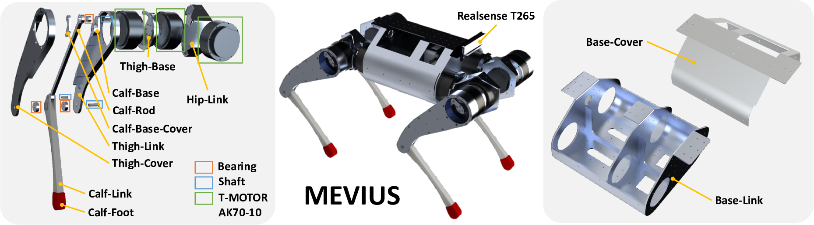

# MEVIUS
This repository includes the hardware and software components of "MEVIUS: A Quadruped Robot Easily Constructed through E-Commerce with Sheet Metal Welding and Machining."

Please refer to the following links for more information.
- [Project Page](https://haraduka.github.io/mevius-hardware)
- [arXiv](https://arxiv.org/abs/2409.14721)
- [YouTube](https://www.youtube.com/watch?v=XXJ4EK3Y4zQ)

# Hardware

You can find all the hardware components in the following link
- [Goodle Drive](https://drive.google.com/drive/folders/18i6CWtUG8fkY0rCcbjN5WiUYItjIX0WM?usp=sharing)



# Software Dependencies
Please install the following dependencies.
- [ROS](https://www.ros.org/)
- [realsense-ros](https://github.com/IntelRealSense/realsense-ros/tree/ros1-legacy)
- [spacenav_node](https://wiki.ros.org/spacenav_node) # optional
- [virtual_joystick](https://github.com/aquahika/rqt_virtual_joystick) # optional
- [urdfdom-py](https://github.com/ros/urdf_parser_py)
- [legged_gym](https://github.com/leggedrobotics/legged_gym)

Please install the following python packages.
- bitstring
- pytorch
- scipy
- mujoco
- mujoco-python-viewer

# Build
```
mkdir -p ~/mevius_ws/src
cd ~/mevius_ws/src
git clone git@github.com:haraduka/mevius.git
cd ..
catkin build
source ~/mevius_ws/devel/setup.bash
```

# Reinforcement Learning
Caution: This policy is very simple and not so stable. Currently, it became very stable with a lot of improvement and will be uploaded soon.

```
# in legged_gym
git remote add haraduka git@github.com:haraduka/legged_gym.git
git fetch haraduka
git checkout haraduka/mevius

# train with two phases
# first phase
python3 legged_gym/scripts/train.py --task mevius
# second phase
# change the parameters in legged_gym/envs/mevius/mevius_config.py from "first" to "second"
# there are two parameters to change: commands.ranges and domain_rand.friction_range
python3 legged_gym/scripts/train.py --task mevius
python3 legged_gym/scripts/play.py --task mevius --load_run ( log_dir )
cp logs/flat_mevius/( log_dir )/exported/policies/policy_1.pt ../mevius/models/policy.pt

```

# Usage
Please test the installation by running the following command.
```
python3 scripts/mevius_utils.py
```
Please test the motors by running the following command.
```
./bin/can_setup.sh
python scripts/tmotor_test.py --ids 1 --task sense
```
Please test the real robot by running the following command.
```
# in the PC of MEVIUS
roscore
roslaunch realsense2_camera rs_t265.launch
./bin/can_setup.sh
python3 scripts/mevius_main.py

# in your local PC
roslaunch spacenav_node classic.launch

# Left Click: SITDOWN/STANDUP, Right Click: STANDUP/WALK

# if you want to simulate the robot in mujoco
python3 scripts/mevius_main.py --sim

# please press D to turn off every-step rendering in mujoco viewer
```

# Acknowledgements
- scripts/tmotor_lib.py is from [mini-cheetah-tmotor-python-can](https://github.com/dfki-ric-underactuated-lab/mini-cheetah-tmotor-python-can)
- scripts/isaacgym_torch_utils.py is from [IsaacGym](https://developer.nvidia.com/isaac-gym)
- scripts/legged_gym_math.py is from [LeggedGym](https://github.com/leggedrobotics/legged_gym)

# Citation
```
@inproceedings{kawaharazuka2024mevius,
  author={K. Kawaharazuka and S. Inoue and T. Suzuki and S. Yuzai and S. Sawaguchi and K. Okada and M. Inaba},
  title={{MEVIUS: A Quadruped Robot Easily Constructed through E-Commerce with Sheet Metal Welding and Machining}},
  booktitle={Proceedings of the 2024 IEEE-RAS International Conference on Humanoid Robots},
  year=2024,
}
```
